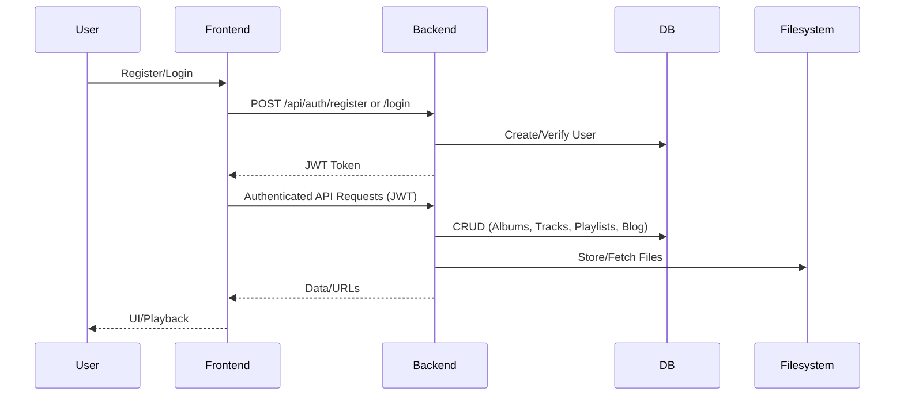
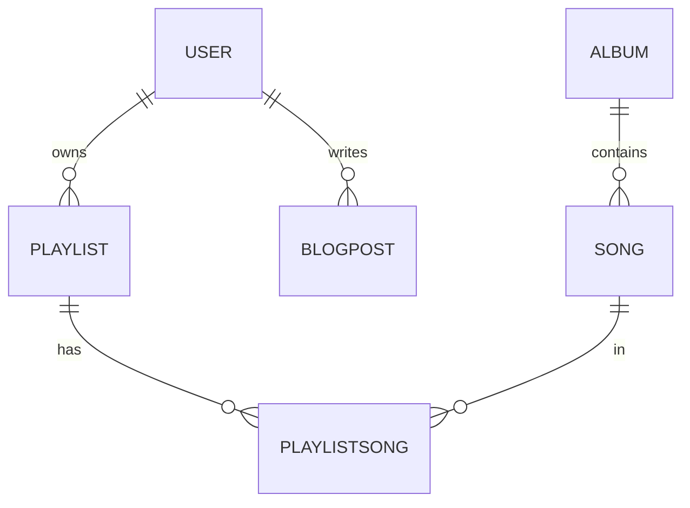
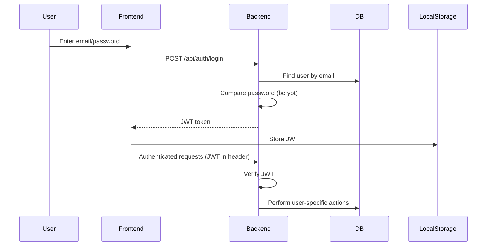
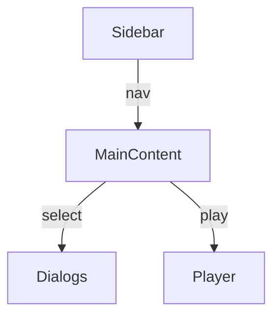

# Snotify Architecture & Product Overview

---

## Table of Contents
- [1. Product Vision](#1-product-vision)
- [2. High-Level Architecture](#2-high-level-architecture)
  - [2.1. System Overview (Mermaid Diagram)](#21-system-overview-mermaid-diagram)
  - [2.2. App Flow (Mermaid Diagram)](#22-app-flow-mermaid-diagram)
  - [2.3. Key Technologies](#23-key-technologies)
- [3. Backend Architecture](#3-backend-architecture)
  - [3.1. Database Schema (Mermaid ER Diagram)](#31-database-schema-mermaid-er-diagram)
  - [3.2. API Routing & Logic](#32-api-routing--logic)
  - [3.3. File Storage](#33-file-storage)
  - [3.4. Authentication Flow (Mermaid Diagram)](#34-authentication-flow-mermaid-diagram)
- [4. Frontend Architecture](#4-frontend-architecture)
  - [4.1. UI Structure](#41-ui-structure)
  - [4.2. State Management](#42-state-management)
  - [4.3. Responsive Design](#43-responsive-design)
- [5. Developer Experience](#5-developer-experience)
- [6. Product Management View](#6-product-management-view)
- [7. Security & Compliance](#7-security--compliance)
- [8. Extensibility & Future Roadmap](#8-extensibility--future-roadmap)
- [9. Directory Structure](#9-directory-structure)

---

## 1. Product Vision

Snotify is a modern, maintainable music storage and player application with playlists, albums, and a blog. It features a responsive, user-friendly UI, secure JWT authentication, and stores all media as files (not blobs) for performance and simplicity. The app is designed for easy extensibility and robust user experience.

---

## 2. High-Level Architecture

### 2.1. System Overview (Mermaid Diagram)

```mermaid
graph TD
  subgraph Frontend [React App]
    FE1[AuthContext]
    FE2[Album Grid]
    FE3[Album Details]
    FE4[Track Upload Dialog]
    FE5[Player]
    FE6[Sidebar/Topbar]
    FE7[Blog/Playlists]
  end

  subgraph Backend [Node.js/Express]
    BE1[Auth Routes]
    BE2[Album Routes]
    BE3[Track Routes]
    BE4[Playlist Routes]
    BE5[Blog Routes]
    BE6[Static File Server]
    BE7[Prisma ORM]
  end

  subgraph Database [MySQL]
    DB1[User]
    DB2[Album]
    DB3[Song]
    DB4[Playlist]
    DB5[BlogPost]
    DB6[PlaylistSong]
  end

  subgraph Storage [Filesystem]
    FS1[uploads/albums/<album_id>/tracks/]
    FS2[uploads/<album_name>/cover.jpg]
  end

  FE1-->|JWT|BE1
  FE2-->|REST|BE2
  FE3-->|REST|BE2
  FE4-->|REST (multipart/form-data)|BE3
  FE5-->|Audio URLs|FS1
  FE6-->|Navigation|FE2
  FE7-->|REST|BE5

  BE1-->|Prisma|BE7
  BE2-->|Prisma|BE7
  BE3-->|Prisma|BE7
  BE4-->|Prisma|BE7
  BE5-->|Prisma|BE7

  BE7-->|SQL|DB1
  BE7-->|SQL|DB2
  BE7-->|SQL|DB3
  BE7-->|SQL|DB4
  BE7-->|SQL|DB5
  BE7-->|SQL|DB6

  BE2-->|File Paths|FS2
  BE3-->|File Paths|FS1
  BE6-->|Serve Files|FS1
  BE6-->|Serve Files|FS2
```

### 2.2. App Flow (Mermaid Diagram)



### 2.3. Key Technologies

- **Frontend:** React, TypeScript, shadcn/ui, Heroicons/lucide-react, React Context, React Router
- **Backend:** Node.js, Express, Prisma ORM, JWT, Multer, music-metadata
- **Database:** MySQL (Prisma-managed)
- **Storage:** Filesystem (uploads directory, paths in DB)
- **Styling:** Tailwind CSS

---

## 3. Backend Architecture

### 3.1. Database Schema (Mermaid ER Diagram)



#### Prisma Schema (Summary)
- **User:** id, email, password, createdAt, updatedAt
- **Album:** id, title, artist, image_url, year, track_count, duration, createdAt, updatedAt
- **Song:** id, title, artist, url, albumId, duration, genre, createdAt, updatedAt
- **Playlist:** id, name, userId, createdAt, updatedAt
- **PlaylistSong:** id, playlistId, songId
- **BlogPost:** id, title, content, userId, createdAt, updatedAt

### 3.2. API Routing & Logic

- **/api/auth:** Register, login (JWT), health check.
- **/api/albums:** CRUD for albums, image upload (multer), fetch by artist.
- **/api/albums/:id:** Get album details.
- **/api/albums/:albumId/tracks:** Upload track (multer), fetch tracks.
- **/api/playlists, /api/blog:** CRUD stubs.

### 3.3. File Storage

- **Images:** `uploads/<album_name>/cover.jpg`
- **Tracks:** `uploads/albums/<album_id>/tracks/<unique>.mp3`
- **DB:** Only relative file paths stored.
- **Static Serving:** Express serves `/uploads` as static.

### 3.4. Authentication Flow (Mermaid Diagram)



---

## 4. Frontend Architecture

### 4.1. UI Structure

- **Sidebar:** Navigation, responsive, collapsible, keyboard shortcut.
- **Top Bar:** (Planned/partial) for quick actions, user info.
- **Main Content:** Album grid, album details, blog, playlists.
- **Dialogs:** Add album, add track, update album art.
- **Player:** Fixed bottom, plays selected track.



### 4.2. State Management

- **AuthContext:** Handles user state, login, logout, registration.
- **Local State:** Album/tracks/related loading, error, selection.
- **Toasts:** Feedback for actions (success/error).

### 4.3. Responsive Design

- **shadcn/ui:** Modern, accessible, mobile-first.
- **Tailwind CSS:** Utility classes for layout, color, spacing.
- **Sidebar:** Collapses on mobile, uses Sheet for drawer.
- **Album Grid:** Responsive columns, cards adapt to screen size.

---

## 5. Developer Experience

- **TypeScript:** Type safety throughout (types, interfaces, zod validation).
- **Prisma:** Type-safe DB access, easy migrations, seed scripts.
- **Modular Components:** UI split into logical, reusable pieces.
- **Hooks:** Custom hooks for album data, audio, mobile detection.
- **.env Config:** Uploads path, JWT secret, DB URL.
- **Testing:** (Recommend adding unit/integration tests for all CRUD and UI flows.)

---

## 6. Product Management View

- **Core Features:**
  - User registration/login (JWT)
  - Album CRUD with image upload
  - Track upload (mp3/m4a), duration extraction
  - Playlist and blog (CRUD stubs)
  - Responsive, modern UI
- **User Stories:**
  - As a user, I can browse albums and see cover art.
  - As a user, I can view album details and play tracks.
  - As a user, I can upload new albums and tracks.
  - As a user, I can manage playlists and read blog posts.
- **KPIs:**
  - Upload success rate
  - Track play reliability
  - Auth/session security
  - Mobile usability

---

## 7. Security & Compliance

- **Passwords:** Hashed with bcryptjs.
- **JWT:** Signed with secret, expiry set.
- **Uploads:** Only file paths in DB, files stored outside web root.
- **Validation:** zod for forms, server-side checks for required fields.
- **Error Handling:** Robust try/catch, user feedback via toasts.
- **Edge Cases:** Handles missing files, invalid IDs, duplicate users.

---

## 8. Extensibility & Future Roadmap

- **Planned/Recommended:**
  - Full CRUD for playlists and blog.
  - User roles/permissions.
  - Track reordering, album editing.
  - Search and filter for albums/tracks.
  - Social features (sharing, comments).
  - API rate limiting, audit logging.
  - Automated tests (Jest, Cypress).
  - CI/CD integration.

---

## 9. Directory Structure

```
Snotify/
  prisma/           # Prisma schema, migrations, seed
  src/
    components/     # UI components (album, player, sidebar, etc.)
    context/        # React context (Auth, Theme)
    hooks/          # Custom React hooks
    lib/            # Backend logic (routes, API, server)
    pages/          # Main page components (Album, Blog, etc.)
    types/          # TypeScript types
    utils/          # Utility functions
    integrations/   # DB and (legacy) supabase integration
  uploads/          # Album images and track files
  public/           # Static assets
  .env              # Environment variables
```

---

*This document is auto-generated for architectural, developer, and product management reference. For questions, see the codebase or contact the maintainers.* 