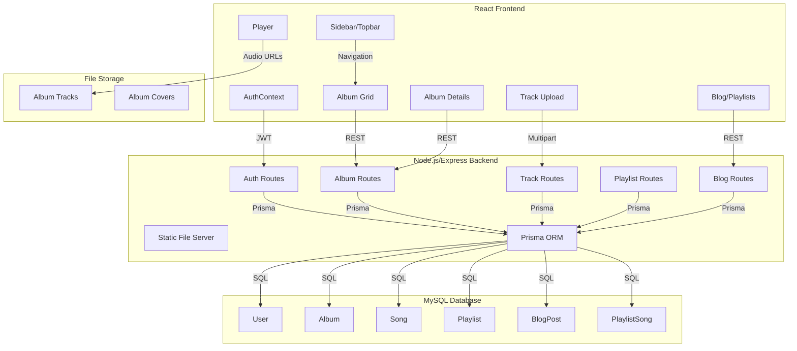
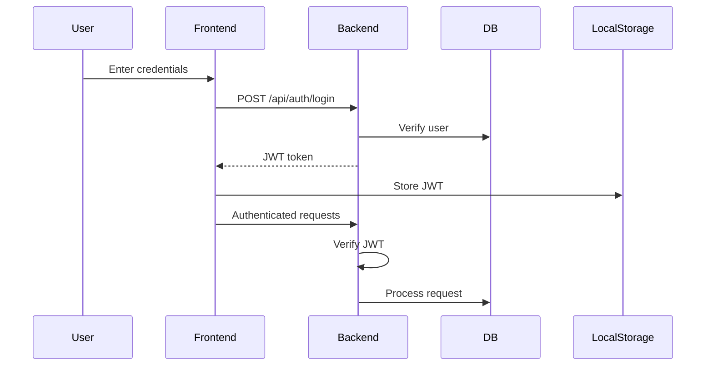

# Snotify Project Management Review

## Project Overview
Snotify is a modern music storage and player application with playlists, albums, and blog functionality. The project is built using React, TypeScript, and Node.js, with a focus on maintainability, performance, and user experience.

## System Architecture

### High-Level System Architecture

### Authentication Flow

## Current Project Status

### Completed Features
- ✅ User authentication system (JWT-based)
- ✅ Album management system
- ✅ Track upload and management
- ✅ Basic playlist functionality
- ✅ Responsive UI with Tailwind CSS
- ✅ File storage system for tracks and album covers

### In Progress
- 🔄 Blog system implementation
- 🔄 Enhanced playlist features
- 🔄 User profile management
- 🔄 Advanced search functionality

### Pending Features
- ⏳ Social sharing features
- ⏳ Advanced analytics
- ⏳ Mobile app development
- ⏳ API documentation
- ⏳ Performance optimization

## Task Tracking

### High Priority Tasks
1. Complete blog system implementation
   - Status: In Progress
   - Priority: High
   - Dependencies: None

2. Enhance playlist features
   - Status: In Progress
   - Priority: High
   - Dependencies: None

3. User profile management
   - Status: In Progress
   - Priority: High
   - Dependencies: Auth system

### Medium Priority Tasks
1. Advanced search functionality
   - Status: Planned
   - Priority: Medium
   - Dependencies: None

2. API documentation
   - Status: Planned
   - Priority: Medium
   - Dependencies: None

### Low Priority Tasks
1. Social sharing features
   - Status: Planned
   - Priority: Low
   - Dependencies: None

2. Advanced analytics
   - Status: Planned
   - Priority: Low
   - Dependencies: None

## Technical Debt and Improvements

### Immediate Concerns
1. Add comprehensive error handling
2. Implement proper logging system
3. Add unit tests for critical components
4. Optimize file upload process

### Future Improvements
1. Implement caching system
2. Add WebSocket support for real-time features
3. Implement CDN for static assets
4. Add automated deployment pipeline

## Risk Assessment

### Current Risks
1. File storage scalability
2. Database performance with large datasets
3. Security vulnerabilities in file upload
4. Mobile responsiveness issues

### Mitigation Strategies
1. Implement file size limits and validation
2. Add database indexing and optimization
3. Regular security audits
4. Comprehensive mobile testing

## Resource Allocation

### Development Team
- Frontend Developers: 2
- Backend Developers: 2
- DevOps Engineer: 1
- QA Engineer: 1

### Infrastructure
- Development Environment: Local
- Staging Environment: Cloud-based
- Production Environment: Cloud-based
- Database: MySQL
- File Storage: Local filesystem (planned migration to cloud storage)

## Next Steps

### Immediate Actions
1. Complete blog system implementation
2. Enhance playlist features
3. Implement user profile management
4. Add comprehensive error handling

### Short-term Goals (1-2 months)
1. Complete API documentation
2. Implement advanced search
3. Add unit tests
4. Optimize performance

### Long-term Goals (3-6 months)
1. Implement social features
2. Add analytics
3. Develop mobile app
4. Migrate to cloud storage

## Conclusion
The Snotify project is progressing well with core features implemented and a clear roadmap for future development. The focus should remain on completing the blog system and enhancing playlist features while addressing technical debt and implementing proper testing procedures. 