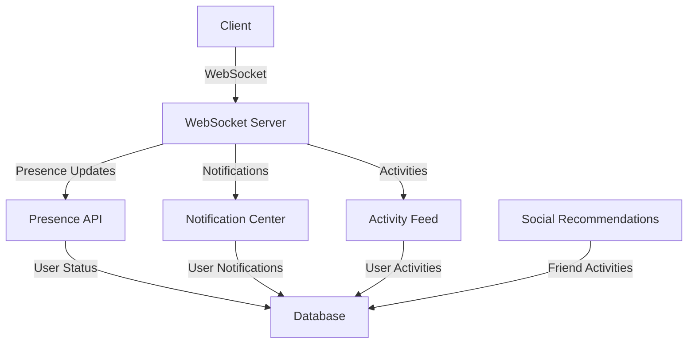
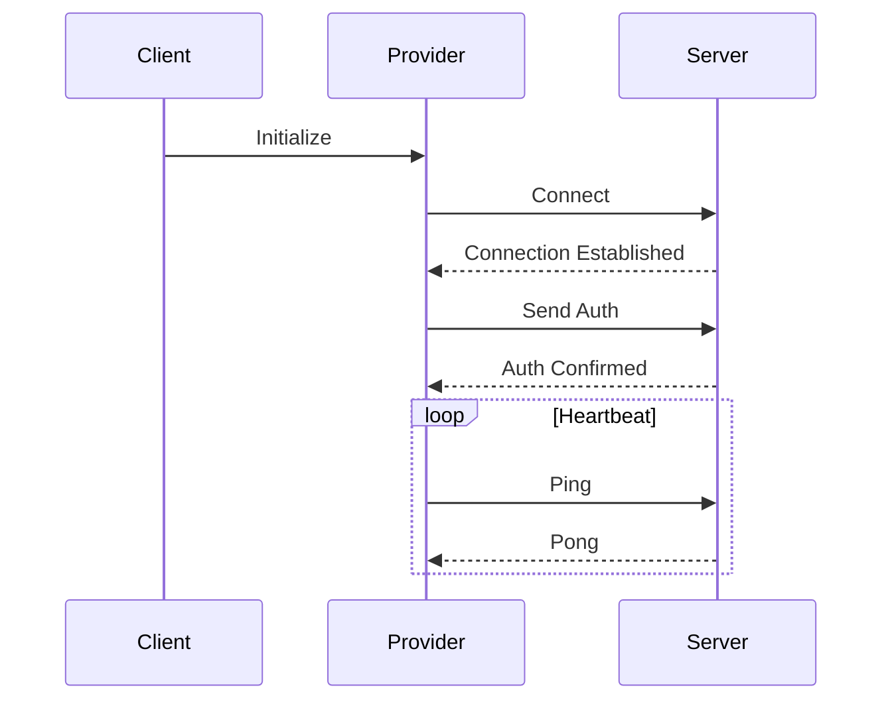
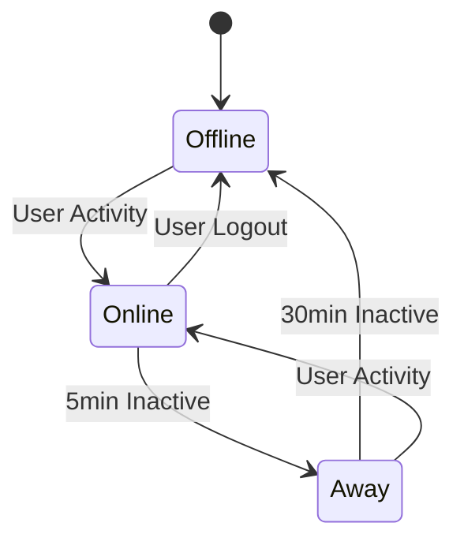
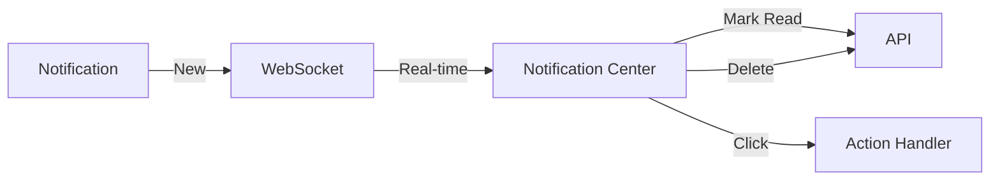
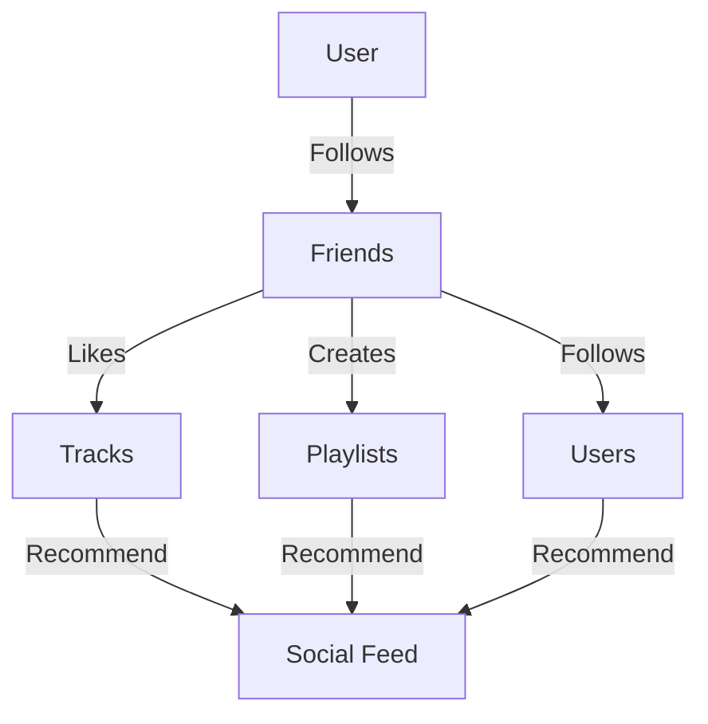
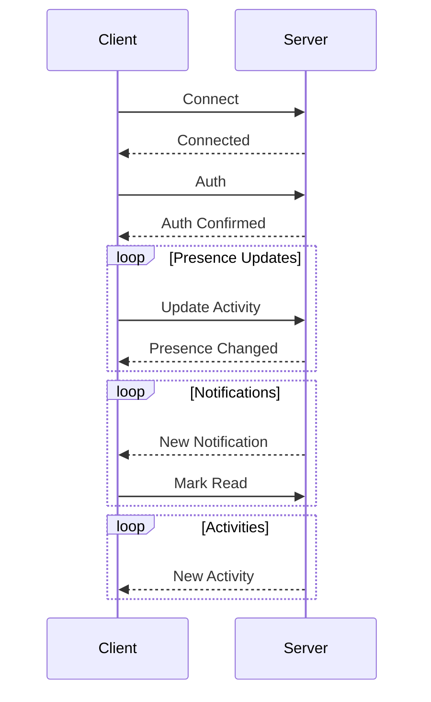

# Social Features Documentation

## Overview

This document outlines the social features implementation in our music streaming application, including real-time presence, notifications, activity feeds, and social recommendations.

## Architecture



## Components

### 1. WebSocket Provider

The WebSocket provider manages real-time connections and provides context to child components.



Key features:
- Automatic reconnection with exponential backoff
- Authentication handling
- Message type system
- Error handling and logging

### 2. Presence System

The presence system tracks user online status and current activity.



Status types:
- Online: Active within last 5 minutes
- Away: Active within last 30 minutes
- Offline: No activity for 30+ minutes

### 3. Notification Center

The notification center displays and manages user notifications.



Notification types:
- Track likes
- Playlist updates
- Follow requests
- Collaboration invites
- Messenger messages

### 4. Social Recommendations

The social recommendations system suggests content based on friends' activities.



Recommendation sources:
- Friend-liked tracks
- Friend-created playlists
- Friend-followed users

## API Endpoints

### Presence API

```typescript
GET /api/presence/[userId]
Response: {
  userId: string;
  status: 'online' | 'away' | 'offline';
  lastSeen: string;
  currentActivity?: {
    type: string;
    name: string;
  };
}

PATCH /api/presence/[userId]
Body: {
  currentActivity?: {
    type: string;
    name: string;
  };
}
```

### Social Recommendations API

```typescript
GET /api/recommendations/social
Response: Array<{
  id: string;
  type: 'track' | 'playlist' | 'user';
  title: string;
  description: string;
  imageUrl?: string;
  metadata: {
    artist?: string;
    duration?: string;
    followers?: number;
    likes?: number;
    friends?: Array<{
      id: string;
      name: string;
      image: string;
    }>;
  };
}>
```

## WebSocket Events



Event types:
1. `auth`: Authentication message
2. `presence`: Presence status updates
3. `notification`: New notifications
4. `activity`: User activity updates
5. `error`: Error messages

## Setup Instructions

1. Install dependencies:
```bash
npm install @tanstack/react-query date-fns sonner
```

2. Add environment variables:
```env
NEXT_PUBLIC_WS_URL=ws://localhost:3001
```

3. Add WebSocket provider to app layout:
```tsx
// src/app/layout.tsx
import { WebSocketProvider } from '@/providers/WebSocketProvider';

export default function RootLayout({ children }: { children: React.ReactNode }) {
  return (
    <html>
      <body>
        <WebSocketProvider>
          {children}
        </WebSocketProvider>
      </body>
    </html>
  );
}
```

## Testing

1. Unit Tests:
```bash
npm test
```

2. WebSocket Testing:
```bash
npm run test:websocket
```

3. Integration Tests:
```bash
npm run test:integration
```

## Monitoring

The WebSocket logger provides detailed logging for debugging and monitoring:

```typescript
wsLogger.debug('Debug message', data);
wsLogger.info('Info message', data);
wsLogger.warn('Warning message', data);
wsLogger.error('Error message', data);
```

Log levels:
- DEBUG: Detailed debugging information
- INFO: General operational messages
- WARN: Warning messages
- ERROR: Error messages

## Future Improvements

1. Real-time chat features
2. Collaborative playlist editing
3. Social sharing enhancements
4. Advanced recommendation algorithms
5. Performance optimizations 